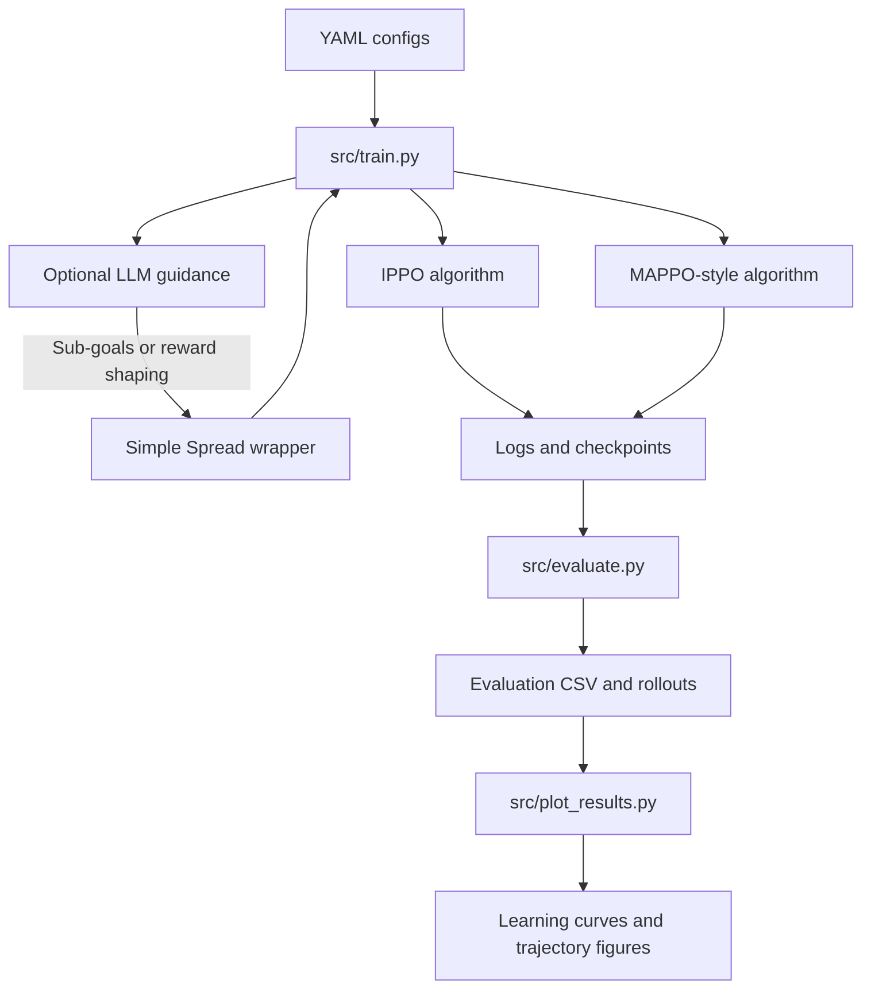

# Technical Documentation

## 1. Project Overview

**Project title:** Multi-Agent Reinforcement Learning with Independent PPO and LLM-assisted Guidance on PettingZoo Simple Spread

This project studies cooperative multi-agent reinforcement learning in the PettingZoo MPE `simple_spread_v3` environment. The task requires multiple agents to spread out and cover multiple landmarks while avoiding collisions. The main baseline is Independent PPO (IPPO), where agents learn decentralized policies from local observations. The comparison method is a basic Multi-Agent PPO / MAPPO-style variant with centralized value estimation. The extension is an optional lightweight LLM guidance module that provides high-level strategy suggestions, sub-goals, or reward shaping rules at episode boundaries or fixed intervals.

The final project should demonstrate:

- Correct multi-agent environment setup with PettingZoo Simple Spread.
- A working IPPO baseline.
- A MAPPO-style comparison method.
- An optional LLM-assisted guidance variant.
- Multi-seed evaluation with quantitative and qualitative analysis.
- Visualizations of learning curves, landmark coverage, collision rate, and agent trajectories.

## 2. Problem Formulation

The environment is formulated as a Decentralized Partially Observable Markov Decision Process (Dec-POMDP).

| Component | Definition in Simple Spread |
| --- | --- |
| Agents | Three cooperative agents by default |
| Landmarks | Three target landmarks by default |
| Global state | Positions and velocities of all agents and landmarks |
| Local observation | Each agent observes its own velocity, relative landmark positions, and relative agent positions |
| Action | Continuous 2D movement action for each agent |
| Reward | Negative landmark coverage distance plus collision penalty |
| Transition | MPE physics simulator updates agent positions and velocities |
| Objective | Maximize team reward by covering landmarks and avoiding collisions |

The main challenge is credit assignment: all agents contribute to the same team objective, but each agent only observes partial information and acts independently during execution.

## 3. Planned Repository Structure

```text
marl-ppo-llm-simple-spread/
├── README.md
├── requirements.txt
├── .env.example
├── configs/
│   ├── ippo.yaml
│   ├── mappo.yaml
│   └── llm_guidance.yaml
├── src/
│   ├── envs/
│   │   └── simple_spread_wrapper.py
│   ├── algorithms/
│   │   ├── ippo.py
│   │   └── mappo.py
│   ├── llm/
│   │   └── guidance.py
│   ├── train.py
│   ├── evaluate.py
│   ├── plot_results.py
│   └── utils.py
├── logs/
├── checkpoints/
├── results/
└── notebooks/
```

## 4. System Architecture



The training pipeline should be config-driven. The same `src/train.py` entry point can select IPPO, MAPPO-style PPO, or LLM-assisted IPPO according to the config file.

## 5. Algorithm Design

### 5.1 Independent PPO Baseline

IPPO treats each agent as an independent PPO learner. Each agent receives its own local observation and outputs its own action. The policy can either be shared across agents or maintained separately per agent. For this project, shared parameters are recommended because the agents are homogeneous and parameter sharing reduces training variance.

Recommended design:

- Actor input: local observation of one agent.
- Actor output: continuous action distribution.
- Critic input: local observation of one agent.
- Critic output: scalar value estimate.
- Training data: per-agent rollout buffer.
- Optimization: PPO clipped surrogate loss with GAE.

IPPO is the primary baseline because it is simple, reproducible, and directly tests decentralized learning in Simple Spread.

### 5.2 MAPPO-Style Comparison

The MAPPO-style method keeps decentralized actors but uses a centralized critic during training. The critic may receive global state or concatenated observations from all agents. During execution, each agent still acts using its own local observation.

Recommended design:

- Actor input: local observation.
- Actor output: per-agent continuous action distribution.
- Centralized critic input: global state or concatenated local observations.
- Critic output: team-level value estimate.
- Advantage estimation: GAE using centralized value estimates.

This method tests whether centralized training improves credit assignment and collaboration compared with IPPO.

### 5.3 LLM-Assisted Guidance

The LLM module should be optional and lightweight. It should not be called at every timestep because API latency and cost would slow training. Instead, it should be called at episode reset, at fixed intervals, or only during selected evaluation episodes.

Possible guidance mechanisms:

- **Sub-goal selection:** Ask the LLM to assign agents to landmarks based on current positions.
- **Reward shaping:** Convert LLM guidance into small auxiliary rewards, such as encouraging each agent to move toward a distinct landmark.
- **Curriculum schedule:** Ask the LLM to choose whether to emphasize collision avoidance or landmark coverage.
- **Strategy label:** Store LLM suggestions as interpretable metadata for analysis.

The final report must explain how natural language guidance is converted into RL-usable signals. If no API key is available, IPPO and MAPPO-style experiments should still run without the LLM module.

## 6. Environment and Dependencies

Recommended Python version:

- Python 3.10 or 3.11

Core dependencies:

| Package | Purpose |
| --- | --- |
| `pettingzoo[mpe]` | Simple Spread multi-agent environment |
| `supersuit` | Environment wrappers for Gymnasium / SB3 compatibility |
| `stable-baselines3[extra]` | PPO reference implementation and utilities |
| `torch` | Neural network backend |
| `gymnasium` | RL environment interface |
| `numpy` | Numerical computation |
| `pandas` | Result aggregation |
| `matplotlib`, `seaborn` | Plotting |
| `imageio`, `opencv-python` | Video or trajectory visualization |
| `openai` or `anthropic` | Optional LLM API integration |
| `python-dotenv` | Load API keys from `.env` |

Environment variables:

```bash
OPENAI_API_KEY=your_openai_api_key_here
ANTHROPIC_API_KEY=your_anthropic_api_key_here
```

Only the actually used provider is required. The `.env` file must not be submitted.

## 7. Hardware Plan

Use the MacBook Pro for:

- Code development.
- Environment setup validation.
- Single-seed smoke tests.
- LLM API debugging.
- Report writing and plotting.

Use the gaming laptop / desktop with RTX 4070 for:

- Full training runs.
- Multi-seed experiments.
- Batch evaluation.
- Final checkpoint and log generation.

SSH is optional. If the gaming laptop is used directly, SSH is not required. If training should be launched from the MacBook, configure SSH and use `tmux` or an equivalent terminal multiplexer so long experiments continue after disconnection.

## 8. Experiment Design

### 8.1 Compared Methods

| Method | Description | Required |
| --- | --- | --- |
| IPPO | Independent PPO with decentralized observations | Yes |
| MAPPO-style PPO | Decentralized actors with centralized critic | Yes |
| LLM-assisted IPPO | IPPO plus high-level LLM guidance | Yes, if API access is available |

### 8.2 Recommended Evaluation Protocol

- Random seeds: `0`, `1`, `2` at minimum.
- Evaluation frequency: every 100 training episodes.
- Evaluation episodes: 10 episodes per checkpoint.
- Training length: start with short smoke tests, then target about 5000 episodes for full experiments.
- Save logs in CSV or TensorBoard format.
- Save best checkpoints for each method.

### 8.3 Metrics

| Metric | Meaning |
| --- | --- |
| Average episode return | Overall team performance |
| Coverage distance | Mean or final distance from each landmark to the nearest agent |
| Collision rate | Frequency of agent-agent collisions |
| Success / coverage quality | Whether landmarks are covered by distinct agents |
| Training stability | Variance across seeds |
| LLM call count and cost | Required for LLM-assisted variant |

### 8.4 Visualizations

Required figures:

- Learning curves with mean and standard deviation across seeds.
- Final performance comparison table.
- Collision rate curve or bar chart.
- Coverage distance curve or bar chart.
- Agent trajectory plots for representative episodes.

Optional figures:

- GIF or video of trained policy rollouts.
- Qualitative comparison of failed vs successful episodes.
- LLM guidance examples and their resulting behavior.

## 9. Reproducibility Requirements

The project should support reproducible experiments through:

- Fixed random seeds for Python, NumPy, PyTorch, and environment resets.
- Config files for all hyperparameters.
- No hard-coded absolute paths.
- Saved logs and checkpoints for each method and seed.
- A `requirements.txt` generated after the environment is stable.
- Clear README instructions for installation, training, evaluation, plotting, and submission packaging.

Suggested run commands:

```bash
python src/train.py --config configs/ippo.yaml
python src/train.py --config configs/mappo.yaml
python src/train.py --config configs/llm_guidance.yaml

python src/evaluate.py --checkpoint checkpoints/ippo_best.pt --config configs/ippo.yaml
python src/plot_results.py --results_dir results/
```

## 10. Main Risks and Mitigations

| Risk | Impact | Mitigation |
| --- | --- | --- |
| PettingZoo / SuperSuit compatibility issues | Environment cannot run | Use Python 3.10 or 3.11 and pin working versions |
| SB3 single-agent assumptions | IPPO wrapper may be awkward | Build a clear multi-agent wrapper or custom rollout loop |
| MAPPO complexity | Full implementation may exceed time | Implement a basic centralized critic PPO as the project comparison |
| LLM latency and cost | Training becomes slow | Call LLM only at episode reset or fixed intervals |
| Unstable multi-agent training | Curves may be noisy | Use at least 3 seeds and report mean plus variance |
| Lack of time before May 4 | Incomplete results | Prioritize IPPO first, then MAPPO-style, then LLM extension |

## 11. Expected Final Deliverables

The final submission should include:

- Source code under `src/`.
- Config files under `configs/`.
- `README.md` with reproducible instructions.
- `requirements.txt`.
- Final report PDF.
- Results figures under `results/`.
- Optional logs and checkpoints if file size allows.
- `docs/submission/SUBMISSION_CHECKLIST.md`.
